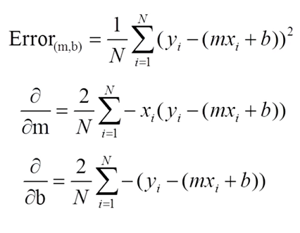

## About the Live Session

### YouTube Video
[How to do Linear Regression using Gradient Descent](https://www.youtube.com/watch?v=XdM6ER7zTLk)

## More learning resources

[An Introduction to Gradient Descent and Linear Regression](https://spin.atomicobject.com/2014/06/24/gradient-descent-linear-regression/)

[Gradient Descent Wikipedia](https://en.wikipedia.org/wiki/Gradient_descent/)

[Gradient Descent For Machine Learning](http://machinelearningmastery.com/gradient-descent-for-machine-learning/)

[Introduction to Gradient Descent Algorithm (along with variants) in Machine Learning](https://www.analyticsvidhya.com/blog/2017/03/introduction-to-gradient-descent-algorithm-along-its-variants/)

[Optimization: Stochastic Gradient Descent](http://ufldl.stanford.edu/tutorial/supervised/OptimizationStochasticGradientDescent/)

## Squared Error Cost Function and Partial Derivatives

## Animation

Here is a visualization of the search running for 200 iterations using an initial guess of m = 0, b = 0, and a learning rate of 0.000005.

