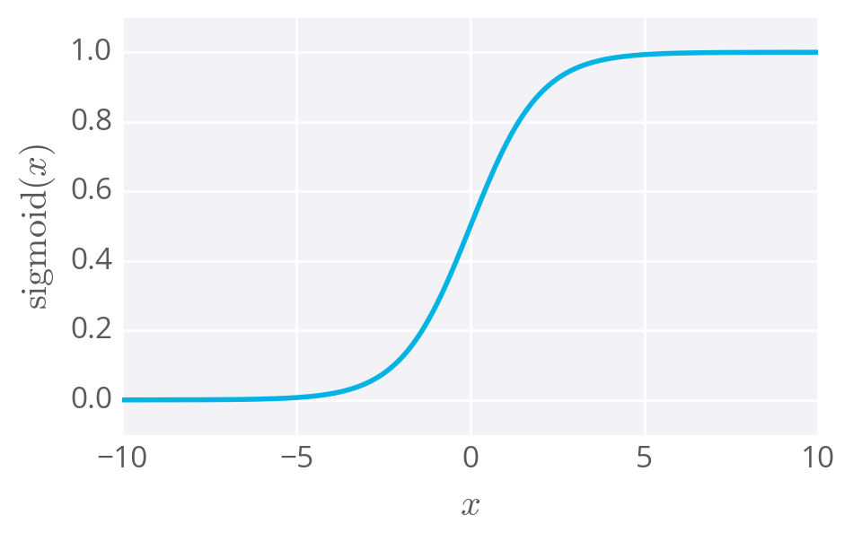

## The simplest neural network

The diagram below shows a simple network. The linear combination of the weights, inputs, and bias form the input **`h`**, which passes through the activation function **`f(h)`**, giving the final output of the perceptron, labeled **`y`**.

The cool part about this architecture, and what makes neural networks possible, is that the _**activation function**_, **`f(h)`** can be _**any function**_.

For example, if you let **`f(h)=h`**, the output will be the same as the input.

Other activation functions you'll see are the logistic (often called the _**sigmoid**_), tanh, and softmax functions. We'll mostly be using the sigmoid function for the rest of this lesson:

The sigmoid function is _**bounded between 0 and 1**_, and as an output can be interpreted as a _**probability for success**_. It turns out, again, using a sigmoid as the activation function results in the same formulation as logistic regression.

This is where it _**stops being a perceptron and begins being called a neural network**_. In the case of simple networks like this, neural networks don't offer any advantage over general linear models such as logistic regression.

But, as you saw with the XOR perceptron, stacking units will let you model linearly inseparable data, impossible to do with regression models.

Once you start using _**activation functions**_ that are _**continuous and differentiable**_, it's possible to train the network using _**gradient descent**_.
